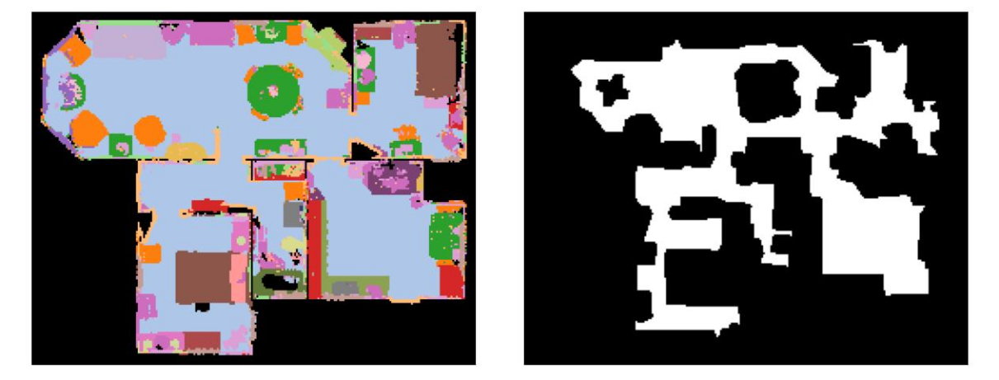
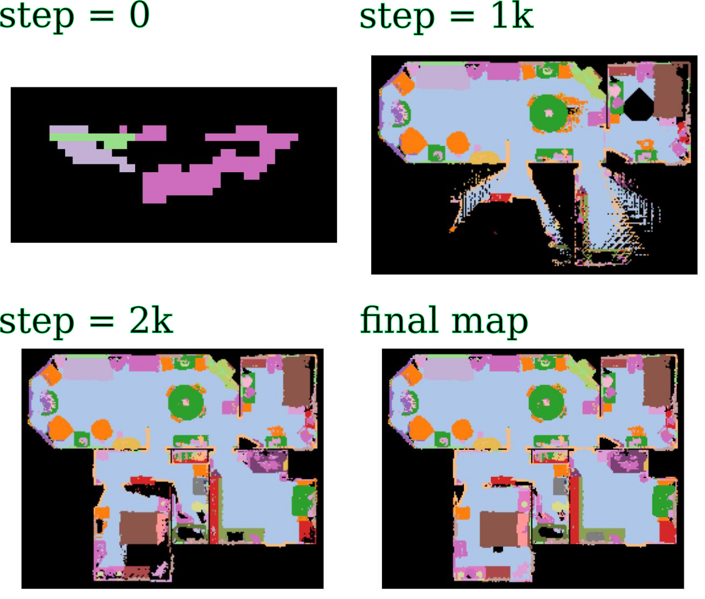
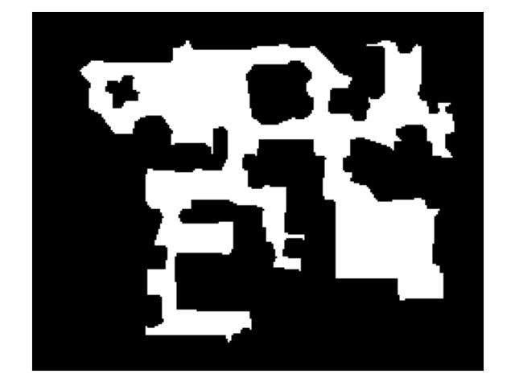
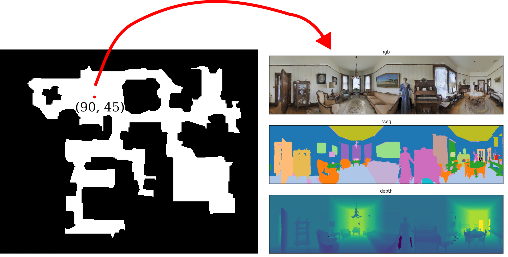
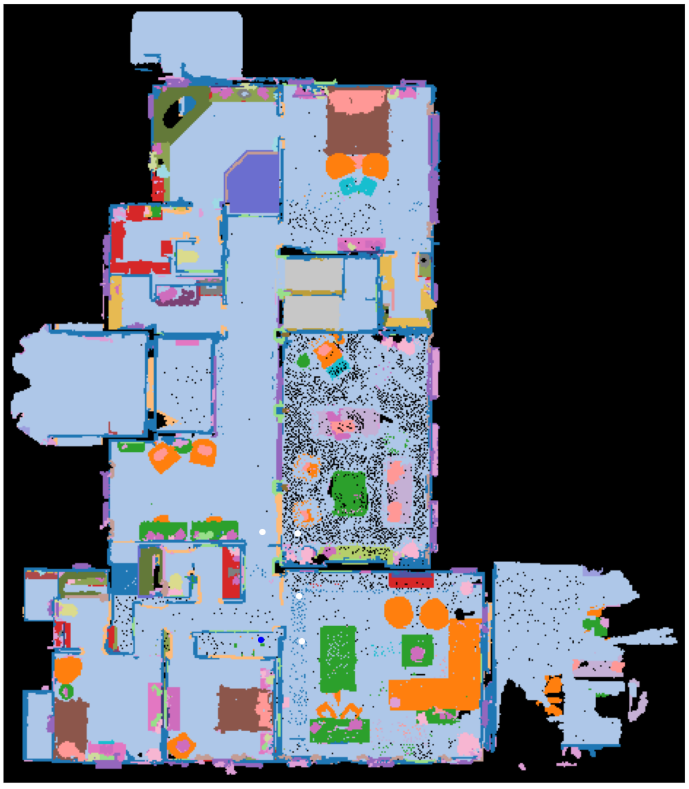

# habitat-tools
[Yimeng Li](https://yimengli46.github.io/) \
George Mason University

### Abstract
This repository provides a minimal set of tools for working with the Habitat environment [[1]](#references) in Python.   
I built these tools when working with the Habitat environment.   
Hopefully, they will be helpful to other people.  



### Implementation Progress Overview
| | Tools | Initial Code | Code Cleanup | Documentation|
|--|--|--|--|--|
|1 | demo: build a semantic map  | :heavy_check_mark: | :heavy_check_mark: |:heavy_check_mark:
|2 | demo: build an occupancy map  | :heavy_check_mark: | :heavy_check_mark: | :heavy_check_mark:
|3 | demo: get a panoramic view at given map coordinates| :heavy_check_mark: | :heavy_check_mark: |:heavy_check_mark:
|4 | code: get category to index mapping | :heavy_check_mark: | :heavy_check_mark: | :heavy_check_mark:
|5 | demo: build semantic map at any height via cutting the point cloud | :heavy_check_mark: | :heavy_check_mark: |:heavy_check_mark:
|6 | demo: build a topological map via skeleton | :heavy_check_mark:
|7 | demo: build a topological map via dense sampling | :heavy_check_mark:


### Dependencies
We use `python==3.7`.  
We recommend using a conda environment.  
```
conda create --name habitat_py37 python=3.7
source activate habitat_py37
```
You can install Habitat-Lab and Habitat-Sim following instructions [here](https://github.com/facebookresearch/habitat-lab "here").  
We recommend installing Habitat-Lab and Habitat-Sim from the source code.  
We use `habitat==0.2.1` and `habitat_sim==0.2.1`.  
Use the following commands to set it up:  
```
# install habitat-lab
git clone --branch stable https://github.com/facebookresearch/habitat-lab.git
cd habitat-lab
git checkout tags/v0.2.1
pip install -e .

# install habitat-sim
git clone --recurse --branch stable https://github.com/facebookresearch/habitat-sim.git
cd habitat-sim
pip install -r requirements.txt
sudo apt-get update || true
# These are fairly ubiquitous packages and your system likely has them already,
# but if not, let's get the essentials for EGL support:
sudo apt-get install -y --no-install-recommends \
     libjpeg-dev libglm-dev libgl1-mesa-glx libegl1-mesa-dev mesa-utils xorg-dev freeglut3-dev
git checkout tags/v0.2.1
python setup.py install --with-cuda
```
### Dataset Setup
1. Download *scene* dataset of **Matterport3D(MP3D)** [here](https://github.com/facebookresearch/habitat-lab/blob/main/DATASETS.md "here").      
2. Upzip the scene data under `habitat-lab/data/scene_datasets/mp3d`.  
3. You are also suggested to download *task* dataset of **PointGoal Navigation on MP3D** [here](https://github.com/facebookresearch/habitat-lab/blob/main/DATASETS.md "here")  
4. Unzip the episode data under `habitat-lab/data/datasets/pointnav/mp3d`.  
5. Create soft links to the data. 
```
cd  habitat_tools
ln -s habitat-lab/data data
```
The code requires the datasets in data folder in the following format:
```
habitat-lab/data
                /datasets/pointnav/mp3d/v1
                                        /train
                                        /val
                                        /test
                /scene_datasets/mp3d
                                    /1LXtFkjw3qL
                                    /1pXnuDYAj8r
                                    /....
                                    /mp3d.scene_dataset_config.json
```


### 1 Demo: Build a Top-Down-View Semantic Map
```
python demo_1_build_semantic_BEV_map.py
```
This demo builds a top-down-view semantic map of the target __scene__ at a specified __height__ (y value of the robot base) by, 
1. initialize a dense grid with a cell size equal to 30cm of the real-world environment.
2. densely render observations (RGB, depth, and semantic segmentation) at each cell's location with eight viewpoint angles.
3. initialize a grid map with cell size equal to 5cm of the real-world environment
4. project semantic segmentation pixels to a 3D point cloud using the depth map and robot pose.
5. discretize the point cloud into a voxel grid and take the top-down view of the voxel grid
6. the semantic map depends on the majority category of the points located at the top grid of each cell.  

The demo outputs a currently maintained map after every 1000 steps.   
   
The built semantic map helps you view the entire scene and generate ObjectNav [[2]](#references) tasks yourself.

### 2 Demo: Build an Occupancy Map
```
python demo_2_build_occupancy_map.py
```
This demo builds an occupancy map of the target __scene__ at a specified __height__ (y value of the robot base) on the top of the pre-built semantic map.  
The occupancy map and the semantic map share the same width and height.  
The demo builds the occupancy map by,  
1. initialize a dense grid with a cell size equal to 5cm of the real-world environment.
2. go through each cell and use `habitat_env.is_navigable()` to check if a cell is free.
3. convert each cell's pose to the coordinates on the map and mark the corresponding map cell with a value of `1` (free) or `0` (occluded).

The demo outputs an occupancy map that looks like this.  
 

### 3 Demo: Get a Panorama at a Given Location
```
python demo_3_get_panorama_at_given_location.py
```
With the built occupancy map, this demo renders a panorama at a given location (coordinates `(90, 45)` on the map).  
   
The idea is to render four views at the given location and stitch the views to form the panorama.


### 4 Code: Get a Mapping from Categories to Index  
```
python demo_4_get_cat2idx_mapping.py
```
This demo shows how to retrieve the mapping between the Matterport3D categories and indexes.
```
dict_cat2idx = {'void': 0, 'wall': 1, 'floor': 2, 'chair': 3, 'door': 4, 'table': 5, 'picture': 6, 'cabinet': 7, 'cushion': 8, 'window': 9, 'sofa': 10, 'bed': 11, 'curtain': 12, 'chest_of_drawers': 13, 'plant': 14, 'sink': 15, 'stairs': 16, 'ceiling': 17, 'toilet': 18, 'stool': 19, 'towel': 20, 'mirror': 21, 'tv_monitor': 22, 'shower': 23, 'column': 24, 'bathtub': 25, 'counter': 26, 'fireplace': 27, 'lighting': 28, 'beam': 29, 'railing': 30, 'shelving': 31, 'blinds': 32, 'gym_equipment': 33, 'seating': 34, 'board_panel': 35, 'furniture': 36, 'appliances': 37, 'clothes': 38, 'objects': 39, 'misc': 40}
dict_idx2cat = {0: 'void', 1: 'wall', 2: 'floor', 3: 'chair', 4: 'door', 5: 'table', 6: 'picture', 7: 'cabinet', 8: 'cushion', 9: 'window', 10: 'sofa', 11: 'bed', 12: 'curtain', 13: 'chest_of_drawers', 14: 'plant', 15: 'sink', 16: 'stairs', 17: 'ceiling', 18: 'toilet', 19: 'stool', 20: 'towel', 21: 'mirror', 22: 'tv_monitor', 23: 'shower', 24: 'column', 25: 'bathtub', 26: 'counter', 27: 'fireplace', 28: 'lighting', 29: 'beam', 30: 'railing', 31: 'shelving', 32: 'blinds', 33: 'gym_equipment', 34: 'seating', 35: 'board_panel', 36: 'furniture', 37: 'appliances', 38: 'clothes', 39: 'objects', 40: 'misc'}
```

### 5 Demo: Build a Semantic Map at any Height via Cutting the Point Cloud
In each episode of the navigation tasks, be it PointGoal, ObjectGoal, or Vision-Language-Navigation (VLN), the robot starts at a particular height within a specific environment.  
Building a semantic map for the same environment but at different heights would be redundant.  
To streamline this process, we adopt a more efficient approach by cutting the point cloud to construct a semantic map online according to the episode's height.  
In this demo, let's use the VLN task as an example.  
#### Dataset Setup
1. Download *task* dataset of **VLN on MP3D** [here](https://dl.fbaipublicfiles.com/habitat/data/datasets/vln/mp3d/r2r/v1/vln_r2r_mp3d_v1.zip "here")
2. Unzip the episode data and put it under `habitat-lab/data/datasets/vln_r2r_mp3d_v1`.

You can collect the point cloud by traversing an environment or you can download it [here](https://drive.google.com/file/d/1u4SKEYs4L5RnyXrIX-faXGU1jc16CTkJ/view, "here"), which is pre-collected by [[3]](#references).  
3. After you download the point cloud, unzip and put it under `habitat-lab/data/other_datasets/mp3d_scene_pclouds`.  
The code requires the datasets in the data folder in the following format:  
```
habitat-lab/data
                /datasets/pointnav
                /datasets/vln_r2r_mp3d_v1
                                         /train
                                         /val_seen
                                         /val_unseen
                /other_datasets/mp3d_scene_pclouds
                                                  /1LXtFkjw3qL_color.npz
                                                  /1LXtFkjw3qL_pcloud.npz
                                                  /1pXnuDYAj8r_color.npz
                                                  /1pXnuDYAj8r_pcloud.npz                 
```
To run the demo
```
python demo_5_build_semantic_map_via_point_cloud.py
```
This demo build at a semantic map at the height `y` at a environment specified in a VLN episode.  
The white circles denote the waypoints.

   

### Citing
I developed this repo while I worked on the following papers.
If you find this code useful, please consider citing them.
```
@inproceedings{li2022comparison,
  title={Comparison of Model Free and Model-Based Learning-Informed Planning for PointGoal Navigation},
  author={Yimeng Li and Arnab Debnath and Gregory J. Stein and Jana Kosecka},
  booktitle={CoRL 2022 Workshop on Learning, Perception, and Abstraction for Long-Horizon Planning},
  year={2022},
  url={https://openreview.net/forum?id=2s92OhjT4L}
}

@article{Li2022LearningAugmentedMP,
  title={Learning-Augmented Model-Based Planning for Visual Exploration},
  author={Yimeng Li and Arnab Debnath and Gregory J. Stein and Jana Kosecka},
  booktitle={IEEE/RSJ International Conference on Intelligent Robots and Systems (IROS)},
  year={2023}
}
```

### References
[1] Savva, M., Kadian, A., Maksymets, O., Zhao, Y., Wijmans, E., Jain, B., ... & Batra, D. (2019). Habitat: A platform for embodied ai research. In Proceedings of the IEEE/CVF international conference on computer vision (pp. 9339-9347). [https://github.com/facebookresearch/habitat-lab](https://github.com/facebookresearch/habitat-lab)  
[2] Ramakrishnan, S.K., Chaplot, D.S., Al-Halah, Z., Malik, J., & Grauman, K. (2022). PONI: Potential Functions for ObjectGoal Navigation with Interaction-free Learning. 2022 IEEE/CVF Conference on Computer Vision and Pattern Recognition (CVPR), 18868-18878.  
[3] Georgakis, G., Schmeckpeper, K., Wanchoo, K., Dan, S., Miltsakaki, E., Roth, D., & Daniilidis, K. (2022). Cross-modal map learning for vision and language navigation. In Proceedings of the IEEE/CVF Conference on Computer Vision and Pattern Recognition (pp. 15460-15470). [https://github.com/ggeorgak11/CM2](https://github.com/ggeorgak11/CM2)
