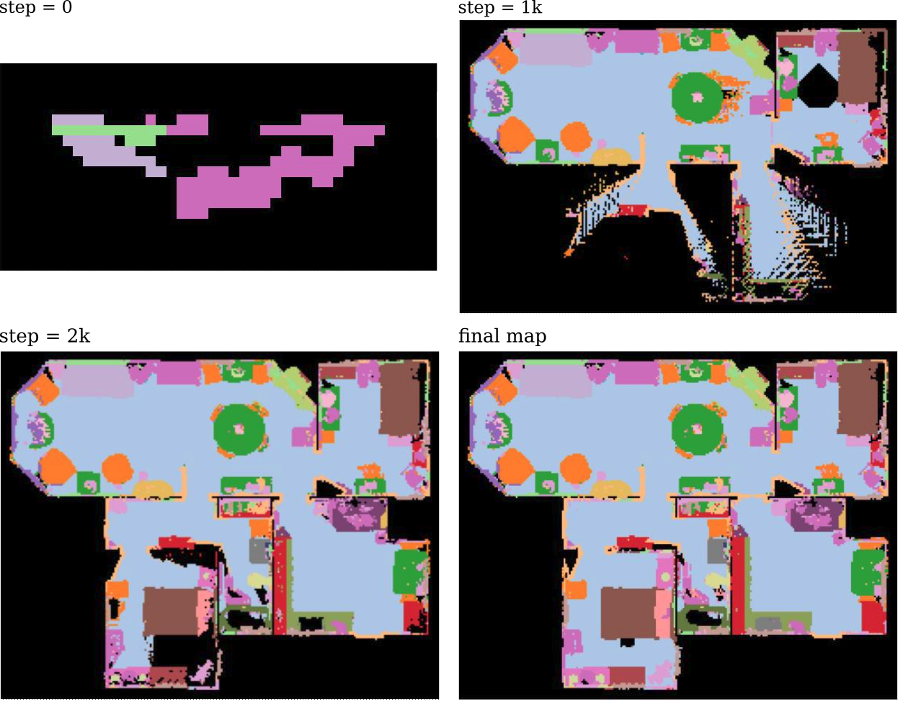

# habitat-tools
This repository provides a minimal set of tools for working with the Habitat environment [[1]](#references) in Python.   
I built these tools when working on research with the Habitat environment.   
Hopefully, they will be helpful to other people.  


#### Implementation Progress Overview
| | Tools | Initial Code | Code Cleanup | Documentation|
|--|--|--|--|--|
|1 | demo: build a semantic map  | :heavy_check_mark: | :heavy_check_mark: |:heavy_check_mark:
|2 | demo: build an occupancy map  | :heavy_check_mark: | :heavy_check_mark: |:heavy_check_mark:
|3 | demo: get a panoramic view at given map coordinates
|4 | get category to index mapping | :heavy_check_mark:
|5 | demo: compute scene floor heights  | :heavy_check_mark:
|6 | build maps with multiprocessing | :heavy_check_mark:
|7 | build maps via point cloud | :heavy_check_mark:
|8 | support for HM3D dataset   | :heavy_check_mark:
|9 | frontier-based exploration | :heavy_check_mark:
|10 | demo: build a topological map | :heavy_check_mark:


#### Dependencies
We use `python==3.7`.  
We recommend using a conda environment.  
```
conda create --name habitat_py37 python=3.7
source activate habitat_py37
```
You can install Habitat-Lab and Habitat-Sim following instructions from [here](https://github.com/facebookresearch/habitat-lab "here").  
We recommend installing Habitat-Lab and Habitat-Sim from the source code.  
We use `habitat==0.2.1` and `habitat_sim==0.2.1`.  
Use the following commands to set it up:  
```
# install habitat-lab
git clone --branch stable https://github.com/facebookresearch/habitat-lab.git
cd habitat-lab
git checkout tags/v0.2.1
pip install -e .

# install habitat-sim
git clone --recurse --branch stable https://github.com/facebookresearch/habitat-sim.git
cd habitat-sim
pip install -r requirements.txt
sudo apt-get update || true
# These are fairly ubiquitous packages and your system likely has them already,
# but if not, let's get the essentials for EGL support:
sudo apt-get install -y --no-install-recommends \
     libjpeg-dev libglm-dev libgl1-mesa-glx libegl1-mesa-dev mesa-utils xorg-dev freeglut3-dev
git checkout tags/v0.2.1
python setup.py install --with-cuda
```
#### Dataset Setup
1. Download *scene* dataset of **Matterport3D(MP3D)** from [here](https://github.com/facebookresearch/habitat-lab/blob/main/DATASETS.md "here").      
2. Upzip the scene data under `habitat-lab/data/scene_datasets/mp3d`.  
3. You are also suggested to download *task* dataset of **PointGoal Navigation on MP3D** from [here](https://github.com/facebookresearch/habitat-lab/blob/main/DATASETS.md "here")  
4. Unzip the episode data under `habitat-lab/data/datasets/pointnav/mp3d`.  
5. Create soft links to the data. 
```
cd  habitat_tools
ln -s habitat-lab/data data
```
The code requires the datasets in data folder in the following format:
```
habitat-lab/data
                /datasets/pointnav/mp3d/v1
                                        /train
                                        /val
                                        /test
                scene_datasets/mp3d
                                    /1LXtFkjw3qL
                                    /1pXnuDYAj8r
                                    /....
                                    /mp3d.scene_dataset_config.json
```


#### 1 Demo: Build a Top-Down-View Semantic Map
```
python demo_1_build_semantic_BEV_map.py
```
This demo builds a top-down-view semantic map of the target __scene__ at a specified __height__ (y value of the robot base) by, 
1. initialize a dense grid with a cell size equal to 30cm of the real-world environment.
2. densely render observations (RGB, depth, and semantic segmentation) at each cell's location with eight viewpoint angles.
3. initialize a grid map with cell size equal to 5cm of the real-world environment
4. project semantic segmentation pixels to a 3D point cloud using the depth map and robot pose.
5. discretize the point cloud into a voxel grid and take the top-down view of the voxel grid
6. the semantic map depends on the majority category of the points located at the top grid of each cell.  

The demo outputs a currently maintained map after every 1000 steps.   
   
The built semantic map helps you view the entire scene and generate ObjectNav [[2]](#references) tasks yourself.

#### 2 Demo: Build an Occupancy Map
```
python demo_build_occupancy_map.py
```
This demo builds an occupancy map of the target __scene__ at a specified __height__ (y value of the robot base).
The occupancy map and the semantic map share the same width and height.
The demo builds the occupancy map by,
1. initialize a dense grid with a cell size equal to 5cm of the real-world environment.
2. go through each cell and use `habitat_env.is_navigable()` to check if a cell is free.
3. convert each cell's pose to the coordinates on the map and mark the corresponding map cell with a value of 1 (free) or 0 (occluded).

The demo outputs an occupancy map that looks like this.  
 


#### References
[1] Savva, M., Kadian, A., Maksymets, O., Zhao, Y., Wijmans, E., Jain, B., ... & Batra, D. (2019). Habitat: A platform for embodied ai research. In Proceedings of the IEEE/CVF international conference on computer vision (pp. 9339-9347). [https://github.com/facebookresearch/habitat-lab](https://github.com/facebookresearch/habitat-lab)  
[2] Ramakrishnan, S.K., Chaplot, D.S., Al-Halah, Z., Malik, J., & Grauman, K. (2022). PONI: Potential Functions for ObjectGoal Navigation with Interaction-free Learning. 2022 IEEE/CVF Conference on Computer Vision and Pattern Recognition (CVPR), 18868-18878.